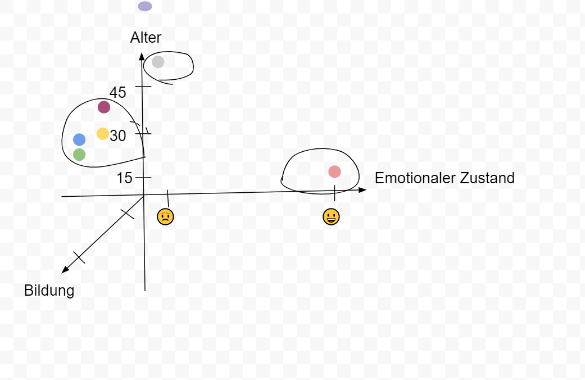
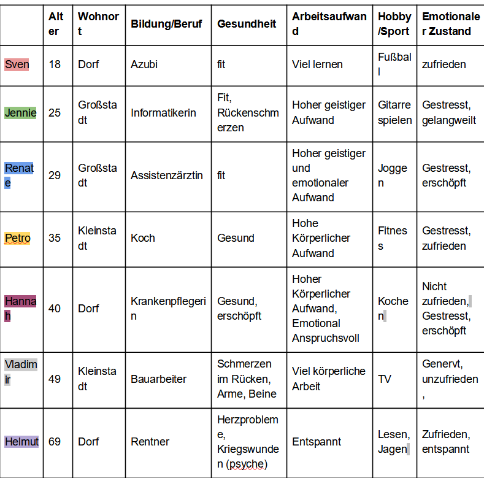
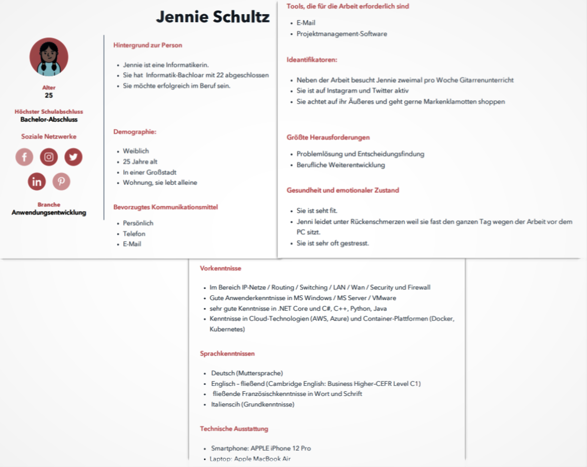

# Persona

## Personenliste (Umfeld)

- Sven

- Jennie

- Renate

- Petro

- Hannah 

- Vladimir

- Helmut

## Kriterien zur Unterscheidung von Personen

Kriterien:

- Alter [jugendlich, junge Erwachsene]

- Wohnort [Großstadt, Kleinstadt, Dorf] 

- Bildungsstand/Beruf [Schulabschluss, Bachelor, Master, Azubi]

- Gesundheit [krank, gesund, labil, stabil]

- Emotionaler Zustand [glücklich, traurig, wütend]

- Arbeitsaufwand? [Körperliche Arbeit, Geistige Arbeit]

- Hobby/Sport

- Ziel Verbesserung des psychischen Zustands [Achtsamkeit, Meditation, Reflektion]

## Relevante Kriterien zur Klassifikation mit Begründung

- Alter [jugendlich, junge Erwachsene]

- Wohnort [Großstadt, Kleinstadt, Dorf] 

- Bildungsstand/Beruf [Schulabschluss, Bachelor, Master, Azubi]

- Emotionaler Zustand [glücklich, traurig, wütend]

Die folgenden Aspekte sind eng miteinander verpflochten und können sich jeweils gegenseitig beeinflussen. 

- Alter [jugendlich, junge Erwachsene, Erwachsene, Senioren]: Bsp: Jemand der jung ist und noch zur Schule geht, ist wahrscheinlich weniger gestresst als ein Student, der arbeiten muss und nebenbei für seinen Master lernen muss. Die App muss somit für jede Altersgruppe geeignet sein. Sie darf also nicht zu schwer zu verstehen sein, muss möglichst kompakt und leicht zugänglich wirken (nicht zu viele Buttons, nicht zu viel Text, groß genug auch für Senioren). Für junge Menschen kann es interessant sein, ihnen eine Motivation in Form von Achievements zu geben (Gamification). 

- Wohnort [Großstadt, Kleinstadt, Dorf]: In einer Stadt ist es lauter als in einem Dorf. Die Wahrscheinlichkeit für Stress und Unzufriedenheit ist höher durch lauten Verkehr, Baustellen, etc. 

- Bildungsstand/Beruf [Schulabschluss, Bachelor, Master, Azubi]: Dieser Aspekt hängt eng mit dem Alter und dem emtotionalen Zustand zusammen. Dies kann in manchen Fällen sogar darüber entscheiden, ob jemand eher glücklich oder frustriert ist (ein Anwalt oder Krankenpfleger ist eher gestresst als z.B. ein Bibliothekar). Die App muss in der Lage sein, alle möglichen Aktivitäten anzubieten (von Schule zu Arbeit zu Uni). Nur so können auch alle Altersgruppen richtig vertreten werden (siehe die Liste aus Aktivitätetn in der Vision).

- Emotionaler Zustand [glücklich, traurig, wütend]: Jemand der traurig oder wütend ist hat mehr Bedarf, sich mit sich selbst auf emotionaler Ebene zu beschäftigen, indem man z.B. eine Art "Selbsttherapie" mittels eines Tagebuchs durchführt. Aber auch jemand in einem glücklichen Gefühlszustand kann sich Zeit nehmen, einen schönen Moment festzuhalten (z.B. in Form eines Tagebucheintrags bzw. einer Notiz). Die App muss also die Möglichkeit bieten, dass jemand der traurig ist, die Chance bekommt, sich tiefer mit diesem Problem auseinanderzusetzen (ggf. durch ein Hilfsangebot für Menschen mit Depressionen oder sogar Aggressions-Problemen etc.). 

## Ausprägung der relevanten Kriterien der Personen des Umfelds

   

## Personenliste (außerhalb)
für welche Ausprägung fehlt Ihnen noch jemand, d.h. mit welchen Eigenschaften müssen Sie noch Leute finden
# Erkenntnisse nach den Interviews
### Tabelle der Persona mit ihren relevanten Kriterien

   

In der Tabelle haben wir 7 verschiedenen Personen eingetragen. Die Namen dieser Personen und die Persönlichkeitsprofile haben anhand der Personen in unserer unmittelbaren Nähe bestimmt. In der ersten Zeile werden alle relevanten Kriterien zur Klassifikation dargestellt. Die Kriterien, die wir als relevant bezeichnen, sind: Alter, Wohnort, Bildung/Beruf, Gesundheitszustand, Arbeitsaufwand, Hobby/Sport und emotionaler Zustand. 

# Personas-Stereotyp-Beschreibung

Wir haben uns für Jenni als Persona entschieden, da wir dadurch unsere Applikation bestmöglich erstellen können. Da Jenni sehr jung ist und die Applikationen meistens von den jungen Menschen benutzt werden, werden die durchschnittlichen Nutzer berücksichtigt. Wegen ihrer Gesundheitsprobleme gehört sie aber auch zur Risikogruppe, wodurch sie sich von vielen jungen Menschen unterscheidet. Wenn ihre Bedürfnisse im Entwicklungsprozess der Applikation umgesetzt werden, wird eine große Anzahl von Menschen berücksichtigt, die zur potenziellen Kundschaft gehören könnte. 

   

